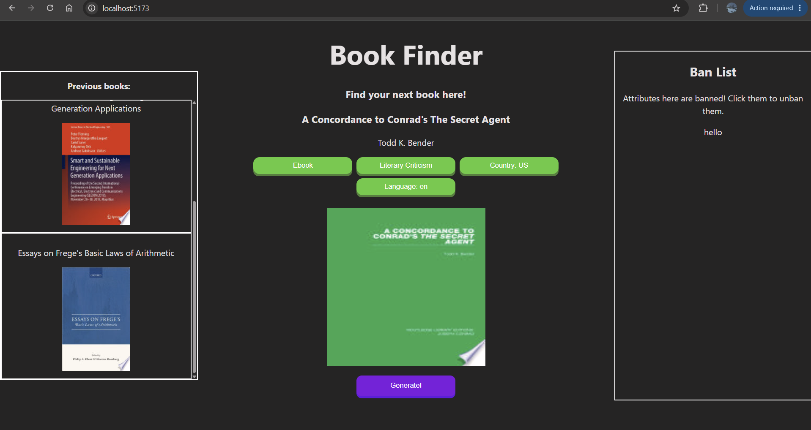

# Explanation

This is an unfinished project from when I was taking the WEB102 course from Codepath. 

Its mostly finished and uses Vite + React (run using "npm run dev"). It uses Google's free book API to get random books and list them out. The "ban attributes" features remains unfinished.  

Here is an example of what the site looks like:
